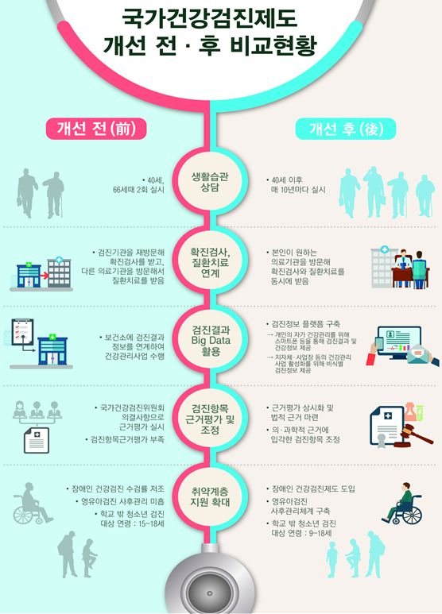

## 데이터선정

1. 데이터 출처

* 진료내역 정보
[공공데이터 포털>진료내역 정보](https://www.data.go.kr/dataset/15007115/fileData.do)

* 건강검진 정보
[공공데이터 포털>건강검진 정보](https://www.data.go.kr/dataset/15007122/fileData.do)

2. 데이터 관련 사진

3. 데이터 선정 이유
* 로우데이터로 이루어져 있음
* 2000년대 초반부터 비교적 최근인 2016년 자료까지 있음
* 한 년도당 100만명의 표본을 포함하고 있음
* 응답의 코드화가 되어있어 데이터 편집이 용이함

4. 데이터의 일부

| 진료내역일련번호 | 성별코드 | 연령대코드 | 시도코드 | 요양개시일 | 서식코드 | 진료과목코드 | 주상병코드 | 부상병코드 |
|-----------------:|---------:|-----------:|---------:|-----------:|---------:|-------------:|-----------:|-----------:|
|                1 |        1 |          2 |       27 |   20121204 |        3 |           23 |       J304 |       J209 |
|                2 |        2 |         14 |       27 |   20121203 |        3 |           23 |       I109 |       I739 |
|                3 |        2 |         14 |       27 |   20121217 |        3 |           23 |       K210 |       R101 |
|                4 |        2 |         14 |       27 |   20121229 |        3 |           23 |       K210 |       R101 |
|                5 |        2 |         13 |       27 |   20121222 |        3 |           23 |       E039 |       M544 |

5. 데이터 분석의 방향
- 연도별 데이터를 성별, 나이대, 진료과목별로 구분한다.
- 각각 정리된 데이터를 비교나열하여 연도별 변화를 확인한다.
- 연도별 달라지는 높은 발병률의 질병, 증상 등을 확인한다.
- 이를 통해서 시간순으로 국민들의 신체적 변화 및 위험에 노출될 수 있는 질병 및 증상을 예측분석할 수 있다.

시간이 지나면서 국민들의 신체적인 변화 및 변화하는 질병들 분석.
이에따른 신체적 변화와 그에 따라 나타날 수 있는 질병을 비교분석하고, 
현재 우리나라 건강검진 항목에 대한 결점 및 문제점 분석, 보완.