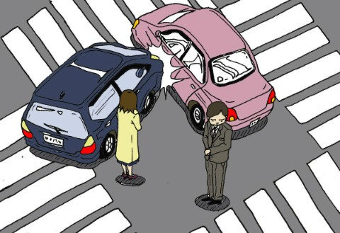

## <데이터 선정>

1. 데이터의 출처와 링크 [공공데이터포털>교통사고 통계](https://www.data.go.kr/dataset/3038489/fileData.do)

2. 데이터와 관련된 사진 

3. 데이터를 선택한 이유
 
 * 어느 장소에서 교통사고가 빈번하게 발생하는지 궁금했기 때문이다.
 * 본 통계 분석을 통해 **운전 시 각별히 주의를 기울여야 하는 장소**를 선정해보고, 해당 장소에서는 더 경각심을 갖도록 하고자 함이다.
 
4. 데이터의 일부를 나타내는 테이블

| 도로형태 | 발생건수 | 사망자수 | 부상자수 | 중상 | 경상 | 부상신고 |
|:--------:|:--------:|:--------:|:--------:|:----:|:----:|:--------:|
| 터널안   | 5        | 0        | 10       | 3    | 6    | 1        |
| 터널안   | 1        | 0        | 4        | 2    | 2    | 0        |
| 터널안   | 3        | 0        | 25       | 5    | 19   | 1        |
| 터널안   | 44       | 0        | 96       | 17   | 74   | 5        |
| 터널안   | 8        | 0        | 21       | 7    | 13   | 1        |

5. 데이터 분석의 방향

- 각 도로형태별 교통사고의 발생건수 비교를 통해 **상대적으로 교통사고가 잦은 장소**를 알아본다. 
- 나아가 각 도로형태별 교통사고로 인해 발생하는 **사망자수, 부상자수, 중상, 경상, 부상신고의 비중**을 비교하여본다. 
_(예를 들어, 교통 사고의 발생건수는 가장 적은데, 사망자수의 비중이 가장 크다면 그 장소는 교통사고가 일어나는 경우 치명타를 입을 수 있는 위험지역이라고 볼 수 있다.)_

