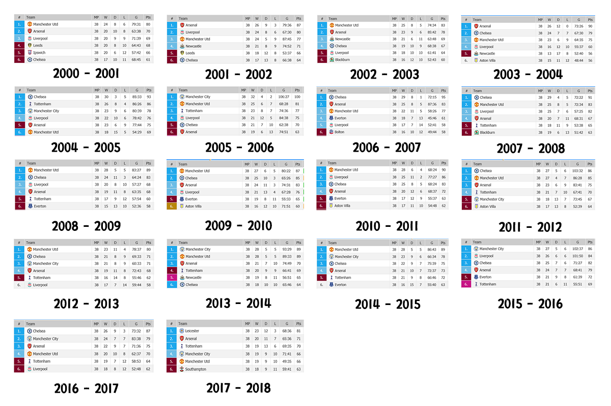

# BIG4의 승점 비교를 통해 파악한 강팀의 특성 분석

### 데이터 출처 및 선정 이유
프리미어 리그는 유럽 축구리그 중에서 가장 대표적인 리그이며, 가장 우승 팀의 변동이 심한 리그이다. 따라서 1993년도부터 현재까지 이 리그의 경기 결과수치를 통해 '축구경기 결과'에 미치는 '요소'들을 알아보기 위해 분석을 진행하였다. 가장 실력이 뛰어나다고 볼 수 있는 BIG4에 집중하여 승점의 추이를 알아보았다.

출처: [Football-Data](http://http://www.football-data.co.uk/englandm.php)

### 데이터 관련 사진 자료
  

### 데이터 불러오기

```{r}
epl_2000 <- read.csv("00_01epl.csv")
epl_2001 <- read.csv("01_02epl.csv")
epl_2002 <- read.csv("02_03epl.csv")
epl_2003 <- read.csv("03_04epl.csv")
epl_2004 <- read.csv("04_05epl.csv")
epl_2005 <- read.csv("05_06epl.csv")
epl_2006 <- read.csv("06_07epl.csv")
epl_2007 <- read.csv("07_08epl.csv")
epl_2008 <- read.csv("08_09epl.csv")
epl_2009 <- read.csv("09_10epl.csv")
epl_2010 <- read.csv("10_11epl.csv")
epl_2011 <- read.csv("11_12epl.csv")
epl_2012 <- read.csv("12_13epl.csv")
epl_2013 <- read.csv("13_14epl.csv")
epl_2014 <- read.csv("14_15epl.csv")
epl_2015 <- read.csv("15_16epl.csv")
epl_2016 <- read.csv("16_17epl.csv")
epl_2017 <- read.csv("17_18epl.csv")
```


### 필요한 데이터만 추출하기

```{r message=FALSE, warning=FALSE}
library(dplyr)
epl_2000 <- epl_2000 %>% 
  select(Date, HomeTeam, AwayTeam, FTHG, FTAG, FTR, HTHG, HTAG, HTR, HS, AS, HST, AST, HC, AC, HF, AF,  HY, AY, HR, AR) %>% 
  filter()

epl_2001 <- epl_2001 %>% 
  select(Date, HomeTeam, AwayTeam, FTHG, FTAG, FTR, HTHG, HTAG, HTR, HS, AS, HST, AST, HC, AC, HF, AF, HY, AY, HR, AR)

epl_2002 <- epl_2002 %>% 
  select(Date, HomeTeam, AwayTeam, FTHG, FTAG, FTR, HTHG, HTAG, HTR, HS, AS, HST, AST, HC, AC, HF, AF, HY, AY, HR, AR)

epl_2003 <- epl_2003 %>% 
  select(Date, HomeTeam, AwayTeam, FTHG, FTAG, FTR, HTHG, HTAG, HTR, HS, AS, HST, AST, HC, AC, HF, AF, HY, AY, HR, AR)

epl_2004 <- epl_2004 %>% 
  select(Date, HomeTeam, AwayTeam, FTHG, FTAG, FTR, HTHG, HTAG, HTR, HS, AS, HST, AST, HC, AC, HF, AF, HY, AY, HR, AR)

epl_2005 <- epl_2005 %>% 
  select(Date, HomeTeam, AwayTeam, FTHG, FTAG, FTR, HTHG, HTAG, HTR, HS, AS, HST, AST, HC, AC, HF, AF, HY, AY, HR, AR)

epl_2006 <- epl_2006 %>% 
  select(Date, HomeTeam, AwayTeam, FTHG, FTAG, FTR, HTHG, HTAG, HTR, HS, AS, HST, AST, HC, AC, HF, AF, HY, AY, HR, AR)

epl_2007 <- epl_2007 %>% 
  select(Date, HomeTeam, AwayTeam, FTHG, FTAG, FTR, HTHG, HTAG, HTR, HS, AS, HST, AST, HC, AC, HF, AF, HY, AY, HR, AR)

epl_2008 <- epl_2008 %>% 
  select(Date, HomeTeam, AwayTeam, FTHG, FTAG, FTR, HTHG, HTAG, HTR, HS, AS, HST, AST, HC, AC, HF, AF, HY, AY, HR, AR)

epl_2009 <- epl_2009 %>% 
  select(Date, HomeTeam, AwayTeam, FTHG, FTAG, FTR, HTHG, HTAG, HTR, HS, AS, HST, AST, HC, AC, HF, AF, HY, AY, HR, AR)

epl_2010 <- epl_2010 %>% 
  select(Date, HomeTeam, AwayTeam, FTHG, FTAG, FTR, HTHG, HTAG, HTR, HS, AS, HST, AST, HC, AC, HF, AF, HY, AY, HR, AR)

epl_2011 <- epl_2011 %>% 
  select(Date, HomeTeam, AwayTeam, FTHG, FTAG, FTR, HTHG, HTAG, HTR, HS, AS, HST, AST, HC, AC, HF, AF, HY, AY, HR, AR)

epl_2012 <- epl_2012 %>% 
  select(Date, HomeTeam, AwayTeam, FTHG, FTAG, FTR, HTHG, HTAG, HTR, HS, AS, HST, AST, HC, AC, HF, AF, HY, AY, HR, AR)

epl_2013 <- epl_2013 %>% 
  select(Date, HomeTeam, AwayTeam, FTHG, FTAG, FTR, HTHG, HTAG, HTR, HS, AS, HST, AST, HC, AC, HF, AF, HY, AY, HR, AR)

epl_2014 <- epl_2014 %>% 
  select(Date, HomeTeam, AwayTeam, FTHG, FTAG, FTR, HTHG, HTAG, HTR, HS, AS, HST, AST, HC, AC, HF, AF, HY, AY, HR, AR)

epl_2015 <- epl_2015 %>% 
  select(Date, HomeTeam, AwayTeam, FTHG, FTAG, FTR, HTHG, HTAG, HTR, HS, AS, HST, AST, HC, AC, HF, AF, HY, AY, HR, AR)

epl_2016 <- epl_2016 %>% 
  select(Date, HomeTeam, AwayTeam, FTHG, FTAG, FTR, HTHG, HTAG, HTR, HS, AS, HST, AST, HC, AC, HF, AF, HY, AY, HR, AR)

epl_2017 <- epl_2017 %>% 
  select(Date, HomeTeam, AwayTeam, FTHG, FTAG, FTR, HTHG, HTAG, HTR, HS, AS, HST, AST, HC, AC, HF, AF, HY, AY, HR, AR)


```

### 결측치 확인하기

```{r message=FALSE, warning=FALSE, paged.print=FALSE}
table(is.na(epl_2000))
table(is.na(epl_2001))
table(is.na(epl_2002))
table(is.na(epl_2003))
table(is.na(epl_2004))
table(is.na(epl_2005))
table(is.na(epl_2006))
table(is.na(epl_2007))
table(is.na(epl_2008))
table(is.na(epl_2009))
table(is.na(epl_2010))
table(is.na(epl_2011))
table(is.na(epl_2012))
table(is.na(epl_2013))
table(is.na(epl_2014))
table(is.na(epl_2015))
table(is.na(epl_2016))
table(is.na(epl_2017))
```

### 결측치 제거하기 

```{r warning=FALSE}
epl_2002[380,]
epl_2002[381,]

epl_2002 <- epl_2002 %>%
  filter(!is.na(FTHG))

epl_2003 <- epl_2003 %>% 
  filter(!is.na(FTHG))

epl_2004 <- epl_2004 %>% 
  filter(!is.na(FTHG))

epl_2014 <- epl_2014 %>% 
  filter(!is.na(FTHG))
```

### 분석 전 대략적인 데이터 확인하기
```{r}
summary(epl_2000)
```


### 데이터 분석하기

#### 1. 홈 경기 vs 원정 경기?

##### 1-1. 홈경기 결과

```{r message=FALSE, warning=FALSE}
library(ggplot2)
library(gridExtra)

top10_score_team_H <- epl_2000 %>% 
  filter(HomeTeam %in% c("Man United", "Arsenal", "Chelsea", "Liverpool", "Leeds", "Charlton", "Ipswich", "Tottenham", "Everton", "Leicester"))

top10_score_team_H <- top10_score_team_H %>% 
  group_by(HomeTeam, FTR) %>% 
  summarise(count = n()) %>% 
  arrange(desc(count))

Home_Result <- ggplot(data = top10_score_team_H, aes(x = HomeTeam, y = count, fill = FTR)) + geom_col(position = "dodge") + scale_x_discrete(limits = c("Man United", "Arsenal", "Chelsea", "Liverpool", "Leeds", "Charlton", "Ipswich", "Tottenham", "Everton", "Leicester")) + coord_flip()
```

##### 1-2. 원정경기 결과

```{r}
top10_score_team_A <- epl_2000 %>%
  filter(AwayTeam %in% c("Liverpool", "Man United", "Leeds", "Ipswich", "Middlesbrough", "Chelsea", "Coventry", "Sunderland", "Man City", "West Ham"))

top10_score_team_A <- top10_score_team_A %>%
  group_by(AwayTeam, FTR) %>% 
  summarise(count = n()) %>% 
  arrange(desc(count))

Away_Result <- ggplot(data = top10_score_team_A, aes(x = AwayTeam, y = count, fill = FTR)) + geom_col(position = "dodge") + scale_x_discrete(limits = c("Liverpool", "Man United", "Leeds", "Ipswich", "Middlesbrough", "Chelsea", "Coventry", "Sunderland", "Man City", "West Ham")) + coord_flip()

grid.arrange(Home_Result, Away_Result)
```

##### 결론: `홈경기가 원정경기보다 훨씬 경기에 유리`한 결과를 가져온다는 사실을 알 수 있다. 이러한 결과가 BIG4의 경우에도 적용되는지 알아보고자 아래 분석을 진행하였다.

#### 2. BIG4에도 적용되는 홈 경기? 원정 경기?

##### 2-1. 홈 경기
```{r}
epl_2000_h <- epl_2000 %>%
  filter(HomeTeam %in% c("Man United", "Arsenal", "Chelsea", "Liverpool")) %>% 
  mutate(Result_h = ifelse(FTR == "H", 3,
                           ifelse(FTR == "A", 0, 1))) %>%
  select(HomeTeam, Result_h) %>% 
  group_by(HomeTeam) %>% 
  summarise(Pts_h = sum(Result_h))

epl_2000_h <- rename(epl_2000_h, Team = HomeTeam)
```

##### 2-2. 원정 경기
```{r}
epl_2000_a <- epl_2000 %>%
  filter(AwayTeam %in% c("Man United", "Arsenal", "Chelsea", "Liverpool")) %>% 
  mutate(Result_a = ifelse(FTR == "A", 3,
                           ifelse(FTR == "H", 0, 1))) %>%
  select(AwayTeam, Result_a) %>% 
  group_by(AwayTeam) %>% 
  summarise(Pts_a = sum(Result_a))

epl_2000_a <- rename(epl_2000_a, Team = AwayTeam)
```

##### 2-3. 홈경기, 원정경기

```{r}
epl_2000_tot <- left_join(epl_2000_h, epl_2000_a, by = "Team")

epl_2000_tot <- epl_2000_tot %>% 
  mutate(tot_pts = Pts_h + Pts_a) %>% 
  arrange(desc(tot_pts))
```

#### 3. 전반에서 승점이 높았던 팀이 계속 그 기세를 몰아 승리할까?

##### 3-1. 전, 후반 경기 결과 경우의 수 - lose draw

```{r}
epl_2000_h_s2 <- epl_2000 %>% 
  filter(HomeTeam %in% c("Man United", "Arsenal", "Chelsea", "Liverpool" )) %>% 
  mutate(Result = ifelse(FTR == "H", 3,
                         ifelse(FTR == "A", 0, 1))) %>%
  filter(HTR == "A" & FTR == "D") %>% 
  group_by(HomeTeam) %>% 
  summarise(Sum_h = sum(Result)) %>% 
  arrange(desc(Sum_h)) %>% 
  select(HomeTeam, Sum_h) 
  
epl_2000_h_s2 <- rename(epl_2000_h_s2, Team = HomeTeam)

epl_2000_a_s2 <- epl_2000 %>% 
  filter(AwayTeam %in% c("Man United", "Arsenal", "Chelsea", "Liverpool")) %>% 
  mutate(Result = ifelse(FTR == "A", 3,
                         ifelse(FTR == "H", 0, 1))) %>%
  filter(HTR == "H" & FTR == "D") %>% 
  group_by(AwayTeam) %>% 
  summarise(Sum_a = sum(Result)) %>% 
  arrange(desc(Sum_a)) %>% 
  select(AwayTeam, Sum_a)

epl_2000_a_s2 <- rename(epl_2000_a_s2, Team = AwayTeam)

epl_2000_ld <- left_join(epl_2000_h_s2,epl_2000_a_s2, by = "Team")
epl_2000_ld

```


##### 3-2. 전, 후반 경기 결과 경우의 수 - lose win
```{r}
epl_2000_h_s3 <- epl_2000 %>% 
  filter(HomeTeam %in% c("Man United", "Arsenal", "Chelsea", "Liverpool")) %>% 
  mutate(Result = ifelse(FTR == "H", 3,
                         ifelse(FTR == "A", 0, 1))) %>%
  filter(HTR == "A" & FTR == "H") %>% 
  group_by(HomeTeam) %>% 
  summarise(Sum_h = sum(Result)) %>% 
  arrange(desc(Sum_h)) %>% 
  select(HomeTeam, Sum_h) 

epl_2000_h_s3 <- rename(epl_2000_h_s3, Team = HomeTeam)

epl_2000_a_s3 <- epl_2000 %>% 
  filter(AwayTeam %in% c("Man United", "Arsenal", "Chelsea", "Liverpool")) %>% 
  mutate(Result = ifelse(FTR == "A", 3,
                         ifelse(FTR == "H", 0, 1))) %>%
  filter(HTR == "H" & FTR == "A") %>% 
  group_by(AwayTeam) %>% 
  summarise(Sum_a = sum(Result)) %>% 
  arrange(desc(Sum_a)) %>% 
  select(AwayTeam, Sum_a)

epl_2000_a_s3 <- rename(epl_2000_a_s3, Team = AwayTeam)

epl_2000_lw <- left_join(epl_2000_h_s3,epl_2000_a_s3, by = "Team")
epl_2000_lw
```

##### 3-3. 전, 후반 경기 결과 경우의 수 - draw win

```{r}
epl_2000_h_s4 <- epl_2000 %>% 
  filter(HomeTeam %in% c("Man United", "Arsenal", "Chelsea", "Liverpool")) %>% 
  mutate(Result = ifelse(FTR == "H", 3,
                         ifelse(FTR == "A", 0, 1))) %>%
  filter(HTR == "A" & FTR == "H") %>% 
  group_by(HomeTeam) %>% 
  summarise(Sum_h = sum(Result)) %>% 
  arrange(desc(Sum_h)) %>% 
  select(HomeTeam, Sum_h) 

epl_2000_h_s4 <- rename(epl_2000_h_s4, Team = HomeTeam)

epl_2000_a_s4 <- epl_2000 %>% 
  filter(AwayTeam %in% c("Man United", "Arsenal", "Chelsea", "Liverpool")) %>% 
  mutate(Result = ifelse(FTR == "A", 3,
                         ifelse(FTR == "H", 0, 1))) %>%
  filter(HTR == "H" & FTR == "A") %>% 
  group_by(AwayTeam) %>% 
  summarise(Sum_a = sum(Result)) %>% 
  arrange(desc(Sum_a)) %>% 
  select(AwayTeam, Sum_a)

epl_2000_a_s4 <- rename(epl_2000_a_s4, Team = AwayTeam)

epl_2000_dw <- left_join(epl_2000_h_s4,epl_2000_a_s4, by = "Team")
epl_2000_dw
```


##### 3-4. 전, 후반 경기 결과 경우의 수 - win win


```{r}
epl_2000_h_s <- epl_2000 %>% 
  filter(HomeTeam %in% c("Man United", "Arsenal", "Chelsea", "Liverpool")) %>% 
  mutate(Result = ifelse(FTR == "H", 3,
                         ifelse(FTR == "A", 0, 1))) %>%
  filter(HTR == "H" & FTR == "H") %>% 
  group_by(HomeTeam) %>% 
  summarise(Sum_h = sum(Result)) %>% 
  arrange(desc(Sum_h)) %>% 
  select(HomeTeam, Sum_h)

epl_2000_h_s <- rename(epl_2000_h_s, Team = HomeTeam)

epl_2000_a_s <- epl_2000 %>% 
    filter(AwayTeam %in% c("Man United", "Arsenal", "Chelsea", "Liverpool")) %>% 
    mutate(Result = ifelse(FTR == "A", 3,
                         ifelse(FTR == "H", 0, 1))) %>%
    filter(HTR == "A" & FTR == "A") %>% 
    group_by(AwayTeam) %>% 
    summarise(Sum_a = sum(Result)) %>% 
    arrange(desc(Sum_a)) %>% 
    select(AwayTeam, Sum_a)

epl_2000_a_s <- rename(epl_2000_a_s, Team = AwayTeam)
  
epl_2000_ww <- left_join(epl_2000_h_s,epl_2000_a_s, by = "Team")
epl_2000_ww

```

##### 알 수 있는 사실
실제 이 시기에 6위였던 Chelsea는 홈 경기에서의 승점이 다른 상위 팀보다 더 높음을 알 수 있다. 그러나, 원정경기의 경우 다른 팀에 비해 상대적으로 승점이 낮다. 따라서 앞선 분석에서도 알 수 있었듯이 대부분의 팀들은 홈경기보다 원정경기에서 더욱 불리한 경기를 보이는 경향이 있다. 원정경기에서 승점이 높은 팀들이 실제 순위에서 높은 경우를 볼 수 있었다.

#### 결론
홈경기는 확실하게 원정경기보다 유리하며 경기결과를 보아도 확실히 알 수 있다.
하지만 홈경기가 유리하다고는 해도 리그 우승을 위해서는 원정경기가 더 큰 영향을 준다.

#### 한계
축구 경기의 승패에 영향을 미치는 더욱 다양한 변수가 데이터에 담겨있지 않아서 승점으로 유추해볼 수 밖에 없었다는 점이 아쉬웠다.  

#### 추후 분석
이후 2001년 뿐 아니라 연도별 자료를 취합하여 분석할 예정입니다.